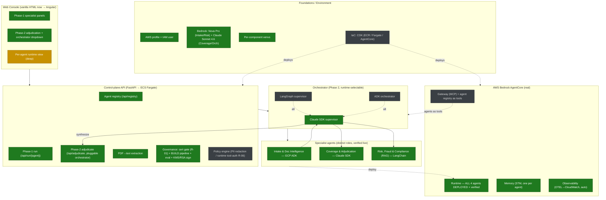
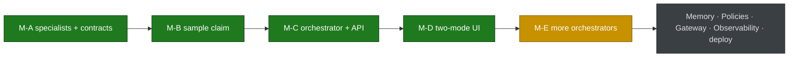

# Build Status Map

Live view of what's **built**, **in progress**, and **planned**. Kept in sync with `BUILDLOG.md`
(history), `PLAN.md` (platform decisions), and the approved scenario plan. Renders on GitHub / IDE.

**Scenario:** Intelligent Claims Adjudication (FNOL → decision). Three framework specialists +
a runtime-selectable orchestrator, all on AgentCore.

**Legend:** 🟩 built & verified · 🟨 in progress / next · ⬜ planned

## Phase progress

## Current focus
- 🟩 **Done:** 3 distinct specialists (ADK Intake, Claude Coverage, LangChain Risk) verified live;
  Claude orchestrator runs the full Intake→Coverage→Risk→decision pipeline (APPROVE, $15,700, ~123s);
  control-plane registry + Phase-1/Phase-2 APIs; two-mode UI at http://127.0.0.1:8770.
- 🟩 **Done (real AWS):** **all 4 agents deployed to AgentCore Runtime** (Intake/ADK, Risk/LangChain,
  Coverage/Claude-SDK, Orchestrator/Claude-SDK), each with Memory + auto observability. **Full pipeline
  verified end-to-end on AgentCore** — orchestrator calls the 3 specialists cross-runtime via
  InvokeAgentRuntime → APPROVE, $15,700, ~183s. No localhost.
- 🟩 **Control-plane repointed** to AgentCore ARNs; drives the deployed pipeline.
- 🟩 **PUBLIC URL LIVE + gated:** control-plane + UI on **AWS App Runner** (auto-HTTPS) behind
  **HTTP Basic Auth** → **<APP_RUNNER_URL>** (user `anuproy2026`).
  Image built via CodeBuild→ECR; instance role invokes the private AgentCore agents.
- 🟩 **Governance — certification-gated deployment (the "Money Shot"):** new `governance.py` router adds
  the **R-01 cert gate** + **BUILD pipeline** (capability → risk → live eval → KMS/RSA-signed cert) +
  revoke/expiry. Same agent: **runs raw, BLOCKED on the platform without a cert.** New **🔐 Governance**
  UI tab (manager-friendly: ✅ runs / ⛔ blocked verdicts). All 5 demo scenarios + tamper test verified
  offline (17/17). Spec in `GOVERNANCE-PLAN.md`; details in `BUILDLOG.md` (2026-06-25).
- 🟩 **Cost:** Intake (ADK) + Risk (LangChain) moved to **Amazon Nova Pro** (AWS-native, cheaper than
  Sonnet); verified live on AgentCore (both return `model=us.amazon.nova-pro-v1:0`). Coverage +
  Orchestrator stay on Claude Sonnet 4.6 — the Claude Agent SDK can't call non-Claude models.
- ⬜ **After:** redeploy Coverage w/ prompt override; KMS/DynamoDB/S3 for prod signing; lock raw bypass;
  **R-06 runtime tool-auth**; Bedrock KB (RAG), Gateway (MCP registry/tools), CDK to codify.

## Local services (dev)
| Service | Framework | Port |
|---|---|---|
| Control-plane + UI | FastAPI | 8770 |
| Coverage | Claude SDK | 8771 |
| Intake | GCP ADK | 8772 |
| Risk | LangChain | 8773 |
| Orchestrator | Claude SDK | 8774 |
