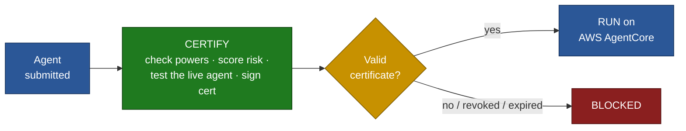

# AgentCore Certifier — Executive Overview

> One idea: **no certificate, no deployment.** An agent must earn a signed certificate before the
> platform will let it run — and that certificate can be revoked to kill it instantly.

**The three moves:**
1. **Earn it** — an agent is tested (capabilities, risk, live accuracy & safety) and, if it passes,
   gets a cryptographically signed certificate.
2. **Gate it** — every run is checked for a valid cert. No valid cert → blocked.
3. **Kill it** — revoke or expire the cert and the agent stops running immediately.

*(Detailed version: [`certifier-flow.md`](certifier-flow.md).)*
