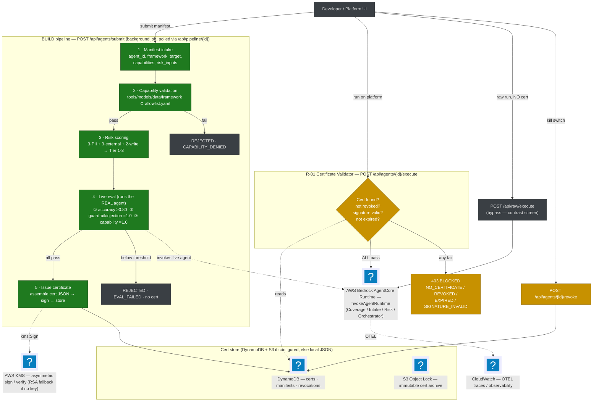

# AgentCore Certifier — High-Level Block Flow

> The **certifier microservice** (`control-plane/app/governance.py`) is a control-plane gate that
> sits *in front of* AWS Bedrock AgentCore. An agent runs freely on **raw AgentCore**, but on **the
> platform** it is BLOCKED unless it carries a valid, cryptographically signed certificate — earned
> by passing a BUILD pipeline, and killable by revocation or expiry (the **R-01** gate).

## Block flow

> Rendered with AWS service icons. To export with icons, pass the Iconify logos pack:
> `mmdc --iconPacks @iconify-json/logos -i docs/certifier-flow.md -o docs/certifier-flow.svg`

## How to read it

- **Earn it (green):** `submit` a manifest → the pipeline validates capabilities against
  `policies/allowlist.yaml`, scores risk, then **invokes the real agent on AgentCore** for 3 live
  tests (accuracy, prompt-injection/guardrail, capability conformance). Pass all → a cert is
  assembled and **signed** (local RSA-2048 by default, AWS KMS if `CERT_SIGNING_KEY_ID` is set) and
  stored.
- **Use it (amber):** `execute` hits the **R-01 validator** — cert exists, not revoked, signature
  verifies, not expired. Pass → forwards to `InvokeAgentRuntime`. Fail → **403 BLOCKED** with a
  specific reason.
- **Contrast / kill switch:** `raw/execute` runs straight on AgentCore with *no* check (proving the
  engine runs anything); `revoke` writes a revocation so the very next `execute` is blocked — same
  for expiry.
- **Pluggable backends:** signing = KMS or local RSA; storage = DynamoDB or local JSON file — same
  signed, verifiable artifact either way.

## Key endpoints

| Method | Path | Role |
|---|---|---|
| POST | `/api/agents/submit` | Start BUILD pipeline (background job) |
| GET  | `/api/pipeline/{exec_id}` | Poll pipeline state + stage log |
| POST | `/api/agents/{id}/execute` | **R-01 gate** → validate cert → `InvokeAgentRuntime` else BLOCKED |
| POST | `/api/raw/execute` | Raw AgentCore, no cert check (contrast) |
| POST | `/api/agents/{id}/revoke` | Kill switch → next execute BLOCKED |
| GET  | `/api/agents/{id}/status` | `CERTIFIED \| REVOKED \| EXPIRED \| NONE` |
| GET  | `/api/certs/{cert_id}` | The signed certificate JSON |
